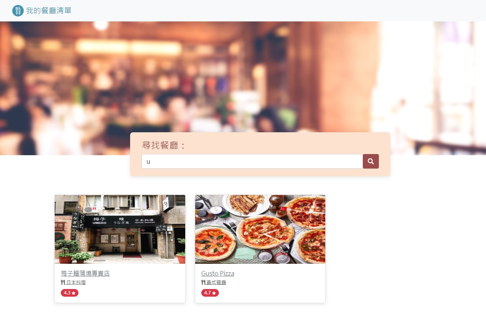

#我的餐廳清單

###專案畫面展示


##專案說明

在這個專案中我將餐廳的json檔案彙整表且導入完成了一個簡單的網頁。
網頁中有展示所有餐廳、單一餐廳以及搜尋的功能。
特別提醒，在搜尋功能中不僅僅只能以"中文"進行搜尋，連帶的以英文搜尋也是可以的。
(ex:梅子鰻蒲燒專賣店的英文店名為"Umeko Japanese Unagi House"，如果使用者搜尋"Umeko"是可搜尋到該餐廳)

###搜尋畫面展示


###單一餐廳畫面展示


##如何使用

```
1.請先確定有無安裝npm以及nodemon，如果沒有請先行安裝
```

```
2.將此專案clone至您的電腦中
```

```
3.使用終端機將其開啟，請進入此資料夾中(cd restaurant_list)
```

```
4.成功進入後直接執行app.js檔案(nodemon app.js)，並使用瀏覽器輸入網址" http://localhost:3000 "
```

```
5.如需結束請回到終端機同時按下ctrl+c
```

```
6.希望你能在上面找到您喜歡的餐廳 <3
```
